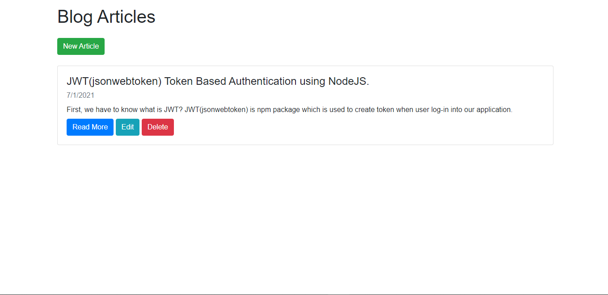
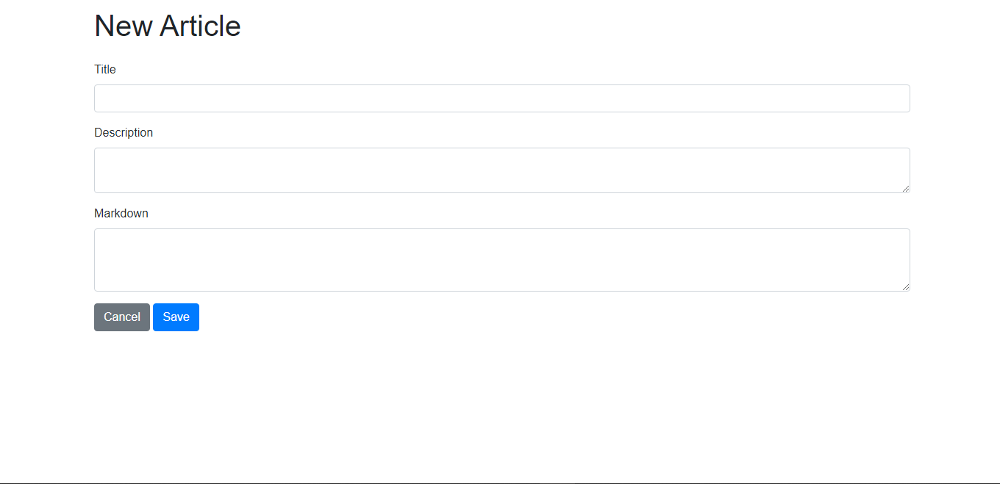
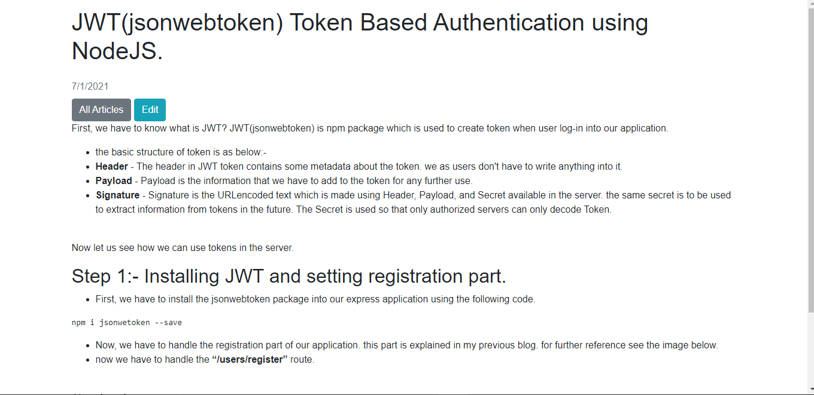
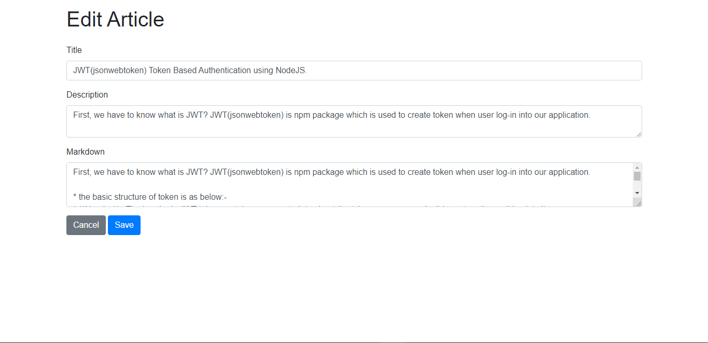

# **_Markdown Blog_**

**_installation_**
```
npm install
```

**_To run the application_**
```
# Production Mode
npm start

# Development Mode
npm run dev
```

<br />

```
Node Version: v14.16.0
```
## **_Application UI_**

**_All Articles_**



<br />

**_Add Article_**



<br />

**_Single Article Page_**



<br />

**_Edit Article_**


